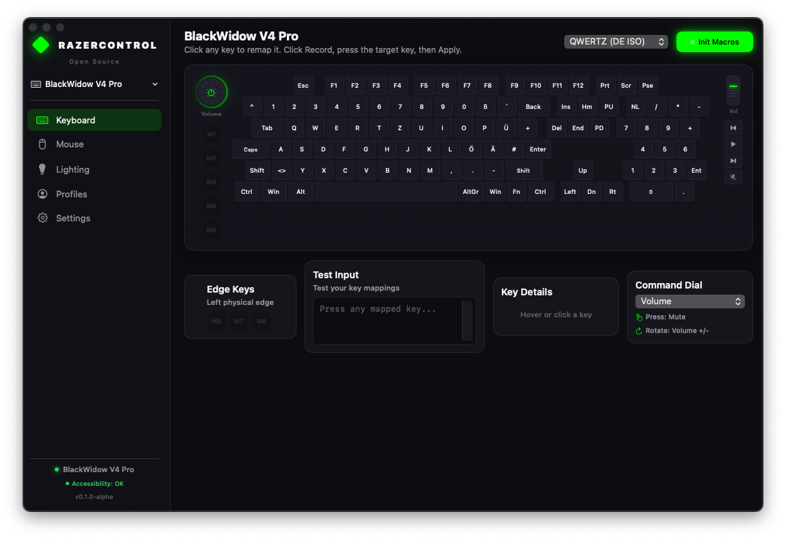
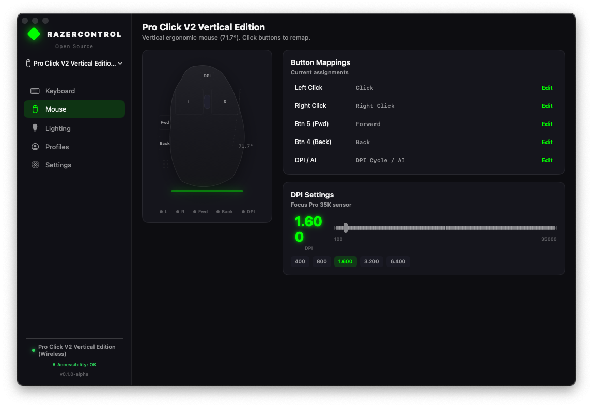
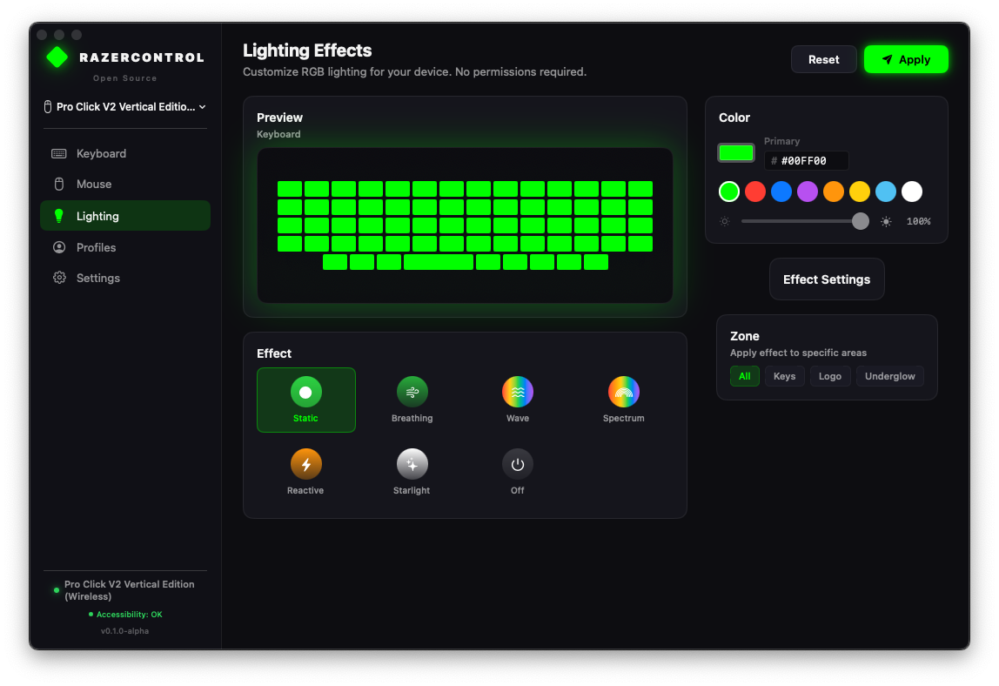

# RazerControl

Open source macOS app for configuring Razer keyboards and mice on **Intel and Apple Silicon** Macs.

Razer Synapse for Mac only supports Apple Silicon. This app fills the gap using the USB HID protocol documented by the [OpenRazer](https://github.com/openrazer/openrazer) project.

## Screenshots

### Keyboard Configuration


### Mouse Configuration


### RGB Lighting


## Features

### Working
- **RGB Lighting** — Static, Breathing, Spectrum, Wave (with speed control), Off. No permissions required.
- **Key Remapping** — Remap any standard key to shortcuts (Cmd+W, Cmd+T, etc), keystrokes, or disable.
- **Mouse Button Remapping** — Remap side buttons to shortcuts or desktop switching.
- **Desktop Switching** — Mouse buttons can switch macOS Spaces via private SkyLight API (external monitor).
- **Multiple Layouts** — QWERTY (US), QWERTZ (DE/CH), AZERTY (FR) keyboard layouts.
- **Persistent Mappings** — All key and mouse mappings saved to disk, auto-restored on launch.
- **No Root Required** — Uses IOKit HID Manager, no kernel extensions or sudo needed.
- **39 Devices** — Device database with keyboards, mice, and accessories.
- **Auto-Detection** — Devices detected automatically via USB hotplug monitoring.

### Known Limitations

| Feature | Status | Reason |
|---------|--------|--------|
| Macro keys (M1-M8) | Not working | V4 Pro macro keys use proprietary HID protocol. Workaround: configure as F13-F17 via Synapse on Boot Camp, then remap here. |
| Switch desktop on MacBook display | Not working | SkyLight API only works on external monitors in multi-monitor setups. Same limitation as yabai. |
| Ctrl+Right/Left (Mission Control) | Not injectable | macOS blocks synthetic keyboard events for Mission Control. Needs DriverKit. |
| Mouse RGB | Not supported | Pro Click V2 Vertical rejects most LED commands. |
| .app bundle key remapping | Requires re-grant | Ad-hoc signed .app changes identity each build. Use `swift run` for development. |

## Supported Devices

Primary test devices (hardware-verified):
- **Razer BlackWidow V4 Pro** — RGB ✅, key remap ✅, firmware query ✅
- **Razer Pro Click V2 Vertical Edition** — button remap ✅, desktop switching ✅

See [device database](Sources/RazerControl/Core/DeviceDB/) for all 39 supported devices.

## Requirements

- macOS 13 (Ventura) or later
- Intel or Apple Silicon Mac
- Razer USB device

## Install

### From source (recommended for development)

```bash
git clone https://github.com/YOUR_USERNAME/RazerControl.git
cd RazerControl
swift build
swift run RazerControl
```

### As .app bundle

```bash
./Scripts/build-app.sh debug
open dist/RazerControl.app
```

### Hardware diagnostic

```bash
swift Scripts/diagnose.swift
```

## Permissions

| Feature | Permission | How to grant |
|---------|-----------|-------------|
| RGB Lighting | None | Works immediately |
| Device Detection | None | Works immediately |
| Key/Mouse Remapping | Accessibility | System Settings > Privacy > Accessibility |
| DPI Settings | None | Works immediately |

When running via `swift run`, Accessibility permission is inherited from Terminal.
When running as .app, grant permission to `RazerControl.app` in System Settings.

## Architecture

```
Sources/RazerControl/
├── App/           Entry point, AppDelegate
├── Core/
│   ├── HID/       IOKit device discovery + USB communication
│   ├── Protocol/  Razer 90-byte USB packet format, CRC, commands
│   ├── DeviceDB/  Static database of 39 Razer PIDs + capabilities
│   └── Permissions/ TCC permission checking
├── Features/
│   ├── KeyMapping/ CGEventTap key/mouse remapping + SpaceSwitcher
│   ├── RGB/        Lighting effect commands
│   └── Profiles/   JSON profiles in ~/Library/Application Support/
└── UI/
    ├── Theme/     Dark theme (Razer green #00FF00)
    ├── Keyboard/  Visual keyboard layout + key mapper
    ├── Mouse/     Vertical mouse layout + button mapper
    ├── Lighting/  Color picker + effect selector + preview
    └── Setup/     Permission request wizard
```

## Technical Details

### USB Protocol
- 90-byte packets: `[status][txid][remaining][proto][size][class][cmd][args...][crc][reserved]`
- CRC = XOR of bytes 2..87
- USB Control Transfer: requestType=0x21, request=0x09, value=0x300, index=0x02
- BlackWidow V4 Pro uses Extended protocol (class 0x0F), transaction ID 0x1F
- Working USB interface: UsagePage 0x0001, Usage 0x0000

### Space Switching
Uses private SkyLight framework (`SLSManagedDisplaySetCurrentSpace`) for desktop switching.
Works on external monitors. Does not work on MacBook builtin display in multi-monitor setups.

## Tests

```bash
swift test  # 43 unit tests
```

## License

GPLv2 — Compatible with [OpenRazer](https://github.com/openrazer/openrazer) from which the device database and protocol documentation are derived.

## Contributing

See [CONTRIBUTING.md](CONTRIBUTING.md) for how to add new devices and submit changes.

## Acknowledgments

- [OpenRazer](https://github.com/openrazer/openrazer) — USB protocol documentation and device database
- [razer-macos](https://github.com/1kc/razer-macos) — macOS RGB control reference
